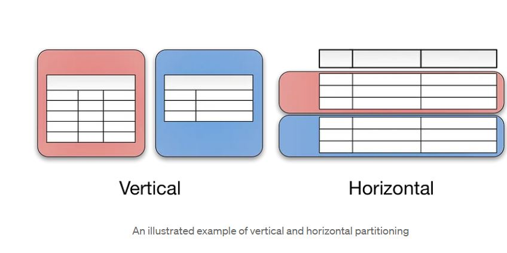

# Table of contents

- [Table of contents](#table-of-contents)
- [study material refernces](#study-material-refernces)
- [HorizontalScaling](#horizontalscaling)
- [vertical scaling](#vertical-scaling)
- [LoadBalancing](#loadbalancing)
  - [hashing](#hashing)
    - [problem with this configuration](#problem-with-this-configuration)
      - [another example of problem](#another-example-of-problem)
  - [ConsistentHashing](#consistenthashing)
    - [links for guide and code](#links-for-guide-and-code)
    - [code walkthrough](#code-walkthrough)
- [CAP theorem](#cap-theorem)
- [bloom filter](#bloom-filter)
- [MessagingQueue](#messagingqueue)
  - [TODO](#todo)
  - [reference\_links](#reference_links)
  - [use\_cases](#use_cases)
    - [a\_simple\_use\_case](#a_simple_use_case)
    - [use\_case\_Imaging\_service](#use_case_imaging_service)
    - [use\_case\_email\_service](#use_case_email_service)
    - [use\_case\_with\_problem\_and\_need\_of\_message\_queue](#use_case_with_problem_and_need_of_message_queue)
  - [General Scenario for using message queue](#general-scenario-for-using-message-queue)
  - [comparsion\_of\_diff\_message\_queue](#comparsion_of_diff_message_queue)
    - [zeroMQ\_vs\_RabbitMQ/ActiveMQ](#zeromq_vs_rabbitmqactivemq)
    - [RabbitMQ\_vs\_ActiveMQ](#rabbitmq_vs_activemq)
  - [inter-service communication vs job processing use case](#inter-service-communication-vs-job-processing-use-case)
  - [installation on windows](#installation-on-windows)
- [database design choosing the right database](#database-design-choosing-the-right-database)
- [choosing structured or non structured database](#choosing-structured-or-non-structured-database)
- [amazone system design (ecommerce system design)](#amazone-system-design-ecommerce-system-design)
  - [Functional Requirements](#functional-requirements)
  - [Non Functional Requirements](#non-functional-requirements)
- [TODO](#todo-1)
- [design a key value database](#design-a-key-value-database)
- [design a unique id generator](#design-a-unique-id-generator)
- [design url shortner TODO mock](#design-url-shortner-todo-mock)
  - [reference](#reference)
  - [HLD](#hld)
- [design search autocomplete system](#design-search-autocomplete-system)
- [redis ( remote dictionary server)](#redis--remote-dictionary-server)
  - [what is redis](#what-is-redis)
  - [usecases](#usecases)
  - [interview response on usage of redis in project](#interview-response-on-usage-of-redis-in-project)
    - [session management using redis in portex](#session-management-using-redis-in-portex)
    - [Problem](#problem)
    - [Probable Solutions](#probable-solutions)
    - [@EnableRedisHttpSession](#enableredishttpsession)
  - [installed redisinsights for visualizing redis data](#installed-redisinsights-for-visualizing-redis-data)
  - [data persistence in redis](#data-persistence-in-redis)
  - [java client to connect application to redis](#java-client-to-connect-application-to-redis)
  - [data types in redis](#data-types-in-redis)
    - [string](#string)
    - [redis lists](#redis-lists)
- [CDN Content delivery network](#cdn-content-delivery-network)
- [database sharding](#database-sharding)
  - [resources](#resources)
  - [Shard or Partition Key](#shard-or-partition-key)
  - [type of sharding](#type-of-sharding)
  - [problems with sharding](#problems-with-sharding)
  - [hash based sharding](#hash-based-sharding)
  - [dynamic sharding](#dynamic-sharding)
  - [sharding a RDBMS](#sharding-a-rdbms)
  - [amazone dynmodb](#amazone-dynmodb)
  - [youtube's Vitess to shard mysql server (TODO)](#youtubes-vitess-to-shard-mysql-server-todo)
- [why we used mongo db in our PORTEX](#why-we-used-mongo-db-in-our-portex)
- [choosing a databases i.e nosql or sql](#choosing-a-databases-ie-nosql-or-sql)
- [Difference between RDBMS and NoSQL databases](#difference-between-rdbms-and-nosql-databases)
  - [NoSQL database misconceptions](#nosql-database-misconceptions)
    - [Misconception: relationship data is best suited for relational databases](#misconception-relationship-data-is-best-suited-for-relational-databases)
    - [Misconception: NoSQL databases don't support ACID transactions](#misconception-nosql-databases-dont-support-acid-transactions)
- [geospatial DB (designing a proximity server by alex xu)](#geospatial-db-designing-a-proximity-server-by-alex-xu)
- [design bookmyshow (DB design imp) TODO](#design-bookmyshow-db-design-imp-todo)

# study material refernces

- gaurav sen youtube and interview ready
- code karle youtube and udemy 
- exponent youtube mock interviews 
- alex xu system design vol1 and vol 2 book
- designing data intensive applications book
- engineering blogs 
- saved posts on linkedin
- https://www.tryexponent.com/blog/system-design-interview-guide
- google youtube channel
- https://www.youtube.com/playlist?list=PLeKd45zvjcDFUEv_ohr_HdUFe97RItdiB
- https://www.hiredintech.com/classrooms/system-design/lesson/55
- https://levelup.gitconnected.com/system-design-interview-survival-guide-2023-preparation-strategies-and-practical-tips-ba9314e6b9e3
 
# HorizontalScaling

is adding more resources i.e in case of aws ec2 instances of 1cpu 2 gb ram adding more ec2 instances to handle the load so in essence we add more resources to handle the increased load.

# vertical scaling

is increasing the size of cpu and ram to handle the increased load, so basically it is buying a bigger maching in case of aws ec2 instace switching from low config t.2.micro cpu 1 ram 2gb ram to high conifg large cpu 16, ram 64 gb ec2 instrances.

# LoadBalancing

is the technique to balance/distribute the load among the backend servers i.e ec2 instances

## hashing

is one of algorithm used by load balancers to distribute the load among the servers.

here let's say we have 4 servers s1,s2,s3,s4
we apply hashing on incoming req to decide which server should handle it.

hash(req_id/user_id) %4
in general hash(req_id/user_id) % N in case of n servers

here hash function parameter could any of the incoming request not specifically req_id it could user_id, name or whatever unique identifier for that request.

few examples

req 1 -> hash(1)%4 = 1 req goes to server no 1
req 6 -> hash(1)%4 = 2 req goes to server no 2
req 100 -> hash(1)%4 = 0 req goes to server no 0
and so on

and it disctributes the load evenly amoung the backend servers i.e load factor 1/N

examine case below.

req 56 -> hash(123)%4 = 3 req goes to server no 3 where 123 is user id
now we know that this req will always go to server no 3 since hash is constant function and user_id will remain the same so instead of doing operations at server like searching the database or any other operation again and again we can have cache at server and for the same req we can send the cached data which can improve the performace by reducing the response time.

### problem with this configuration

refer the links below if do not understand the problem
https://michaelnielsen.org/blog/consistent-hashing/

Now if think about the caching scenario above the problem with this configuration is when we add and or remove the servers.
let's say i add another server 5 now many of the request which were going to let's s1 will go to s2 now and many of the req going to s2 will now go to s3 and same for rest of the servers so their caches stored at old servers will not be useful anymore.

since there are 5 servers the load will be 20% on each so now observer below the change impact

s1 5% load will go to s2 and
s2 will have 5% new load from s1 i.e to build new cache
s2 10 % load will go s3
s3 will have 10% new load from s2 i.e to build new cache
s3 15% load will go to s4
s4 will have 15% new load from s3 i.e to build new cache
s4 20% load will go to s5
s4 will have 20% new load from s4 i.e to build new cache

so in this case 5+5+10+10+15+15+20+20 = 100%
change impact is 100% i.e almost all the cache at instance level will be useless now.
so consistent hashing will solve this problem

#### another example of problem

Naive hash-based distributed dictionaries are simple, but they have serious limitations. Imagine you’re using a cluster of computers to crawl the web. You store the results of your crawl in a distributed dictionary. But as the size of the crawl grows, you’ll want to add machines to your cluster. Suppose you add even just a single machine. Instead of computing hash(k)\mod(n) we’re now computing hash(k)\mod(n+1). The result is that each key-value pair will get reallocated completely at random across the cluster. You’ll end up moving a fraction n/(n+1) of your data to new machines – i.e., nearly all of it. This will be slow, and might potentially be expensive. It’s also potentially inconvenient if jobs are being carried out. Similar problems arise if you add a larger block of machines to the cluster, or if you lose some machines (e.g., if some of the machines fail). You get the idea.

## ConsistentHashing

to understand refer the image below and external links

now to solve this problem with adding and removing servers in normal hashing, an algorithm called consisten hashing is used

let's say there are n servers and each server has a server id e.g 223
now imagine a ring with m points ranging from 0,1,2,.... m-1 in clockwise direction
ow hash(server_id)% m gives us the location in ring where server will be placed i.e that no from the ring can be assigned to the server
so for 4 servers will be distributed uniformally in the ring
now req using the hashing {hash(req_id/user_id)/4 } will give some point location in the ring, now request from that point will go to nearest server in clockwise direction now with this configuration ideally load will distributed uniformly but if server count is very small then we might skewed configuration where load is not uniform across the servers, so to tackle this problem we apply multiple hashing function h1,h2...hk i.e k hashing function on sever id to place the servers in the ring but how can one server be placed in multiple point location in the ring it can't it's virtual i.e all those points are mapped to server e.g 3 points across the ring are mapped to s1, 3 for s2 and so on so this way when we add or remove servers we actually add or remove multiple points in ring and no of requests impacted are less and distributed uniformly to remaing servers since virtual points are spread across the ring

change will be 1/(n+1) for adding a server which quite low so it quite effective technique and used in lot of places web caches, databases, memcahed, Amazon’s Dynamo key-value store etc.


### links for guide and code

https://github.com/coding-parrot/Low-Level-Design/blob/master/service-orchestrator/src/main/java/algorithms/ConsistentHashing.java

https://michaelnielsen.org/blog/consistent-hashing/

### code walkthrough

if you look at the code of hash function this is what will gives the virtual points locations on the ring where server will placed logically

- nodepositions map contains the node and it's corresponding all virtual positions i.e node1,[1,11,41] etc
- nodemapping map is navigable map implementation like treeMap or concurrentSkipListMap that contains the mapping of virtual point locations to real nodes in sorted order of point locations
  sorting here is for clockwise direction navigation

and we need three functions here one to add node, remove node and getassigned node

now pointmultiplier specifies how many virtual positions we want for a server if we want 2 virtual positions that way node mapping will have enteries like
node1->[1,31]
node2->[11,41]

- in add function
  loop the pointmultiplier times i.e 2 times apply the hash function on server/node (i \* pointmultiplier)+ nodeid to get the virtual position on ring and then store the result to nodemappings map and nodeposition map

- in remove function remove the node from nodepositions and then all positions from node mappings for the node

- in get assigned node function

apply the hash function to req to get the position on ring and then nodemapping.higherEntry(req_position) will give the node which will handle the request

# CAP theorem
C stands for consistency 
A stands for availability
P stands for partition tolerance

- for any distributed system CAP theorem stats that only 2 of these properties can be guarantied and practally it is assumed that network partition can not be avoided so partition tolerance has to be part of the system design, therefore choice is to make tradeoff between consistency & availability. e.g for bank transaction systems consistency is preferred over availability and for systems like youtube or other ott availability is more important than consistency

# bloom filter
watch bytebyte go youtube video

# MessagingQueue

In modern cloud architecture, applications are decoupled into smaller, independent building blocks that are easier to develop, deploy and maintain. Message queues provide communication and coordination for these distributed applications. Message queues can significantly simplify coding of decoupled applications, while improving performance, reliability and scalability.

Message queues allow different parts of a system to communicate and process operations asynchronously. A message queue provides a lightweight buffer which temporarily stores messages, and endpoints that allow software components to connect to the queue in order to send and receive messages. The messages are usually small, and can be things like requests, replies, error messages, or just plain information. To send a message, a component called a producer adds a message to the queue. The message is stored on the queue until another component called a consumer retrieves the message and does something with it.


Many producers and consumers can use the queue, but each message is processed only once, by a single consumer. For this reason, this messaging pattern is often called one-to-one, or point-to-point, communications. When a message needs to be processed by more than one consumer, message queues can be combined with Pub/Sub messaging in a fanout design pattern
refer https://aws.amazon.com/pub-sub-messaging/ for more details
Amazone SNS is one of example of pub/sub model

## TODO

- check usagae in portex
- how it actually works(LLD)

## reference_links

- http://blog.codepath.com/2013/01/06/asynchronous-processing-in-web-applications-part-2-developers-need-to-understand-message-queues/

- https://www.youtube.com/watch?v=oUJbuFMyBDk&list=PLMCXHnjXnTnvo6alSjVkgxV-VH6EPyvoX&index=5

- https://www.cloudamqp.com/blog/what-is-message-queuing.html

## use_cases

### a_simple_use_case

Imagine that you have a web service that receives many requests every second, where no request can get lost, and all requests need to be processed by a function that has a high throughput. In other words, the web service always has to be highly available and ready to receive a new request instead of being locked by the processing of previously received requests.

In this case, placing a queue between the web service and the processing service is ideal. The web service can put the "start processing" message on a queue and the other process can take and handle messages in order. The two processes are decoupled from each other and do not need to wait. If you have a lot of requests coming in a short amount of time, the processing system will be able to process them all. The queue will persist with the requests even if their number grows.

Then imagine that the business and workload are growing and the system needs to be scaled up. All that needs to be done is to add more consumers to work off the queues faster.


### use_case_Imaging_service

Another use case could be when working on an imaging system where people upload images and then you have a service that generates thumbnails for each uploaded message, in this case, your best solution would be to implement the concept of “message queue.

### use_case_email_service

email communication is also a use case for Messgaing Queue where sender sends the mail and an immediate response is message sent to sender(msg has been sent), however the email is placed on a queue which is then process later by consumer component of the service and once it is processed by the consumer then reciever recieves the mail so here producer and sender are communicating asynchronously and neither one waits for another and decoupled from each other. Also if the message is failed for any reasone you get the response after some time

### use_case_with_problem_and_need_of_message_queue

consider the popular pizza shop/server like dominoes, now let's assume there are 3 shops serving orders now if one shops goes down i.e it becomes unable to serve and inprogress orders also needs to rerouted to other shops now for this we need persistence storage of order information.

let's assume a persistence storage with order information like order ip and server serving that order with server id

now we can find all the unfinished order from down server and distibute those orders to remaining shops/server via load balancing(consistent hashing) however here we also need a heartbeat check service(notifier) which whose job is to keep checking is the server is alive i.e every 5 sec or 10 sec and to notify of the changes etc

so in essence we need a hearbeat check service + persistent storage + load balancing(consistent hashing)
and a message queue is what has all these features like rabbitMQ,Aapache ActiveMQ,ZeroMQ JMS etc

## General Scenario for using message queue

- Servers are processing jobs in parallel.
- A server can crash. The jobs running on the crashed server still needs to get processed.
- A notifier constantly polls the status of each server and if a server crashes it takes ALL unfinished jobs (listed in some database) and distributes it to the rest of the servers. Because distribution uses a load balancer (with consistent hashing) duplicate processing will not occur as job_1 which might be processing on server_3 (alive) will land again on server_3, and so on.
- This "notifier with load balancing" is a "Message Queue".

## comparsion_of_diff_message_queue


### zeroMQ_vs_RabbitMQ/ActiveMQ

The interesting thing to understand is that ZeroMQ is actually not so much a pre-packaged message queue like the others but instead acts as a framework for building message queues.ZeroMQ focuses mostly on just passing the messages very efficiently over the wire while RabbitMQ acts as a full-fledged ‘broker’ which handles persisting, filtering and monitoring messages.
Think of ZeroMQ as it’s own toolbox or framework for creating message queues tailored to your own needs

- Of course, with RabbitMQ or ActiveMQ, the broker and persistence built in adds quite a bit of overhead but those libraries choose to sacrifice raw speed to provide a much richer feature set with less manual tinkering.
- choose ZeroMQ if you are looking for more control, raw speed and are interested in a light-weight, do-it-yourself protocol for delivering messages. In other cases where you just want to use a queue for typical use cases and you are willing to accept the higher overhead, you should consider RabbitMQ or ActiveMQ.

### RabbitMQ_vs_ActiveMQ

ActiveMQ is built in Java on the JMS (Java Message Service) and is very frequently used within applications on the JVM (Java, Scala, Clojure, et al).ActiveMQ also supports STOMP which provides support for Ruby, PHP and Python.RabbitMQ is built on Erlang, powered by AMQP and is used frequently with applications within Erlang, Python, PHP, Ruby, et al.
the configuration for ActiveMQ is in XML and the routing of messages is handled with custom rules defined by ActiveMQ. In contrast, the configuration of RabbitMQ is through an Erlang syntax and the advanced routing and configuration follows standard AMQP specifications. The protocols (AMQP vs JMS) used by each queue have certain underlying differences as well. One key difference is that in AMQP a producer sends a message to the broker without knowing the intended distribution strategy while in JMS the producer is aware of the strategy to be used explicitly.

## inter-service communication vs job processing use case


For the average web application though, the requirements are very different. To understand your requirements, ask yourself if you are sending messages to communicate between different services in your application or if you just want to process simple background jobs. In the latter case, we certainly don’t need the most powerful or flexible message queue nor the expensive associated setup costs.
Most popular web applications really only need a way to do background job processing and offload tasks to an asynchronous queue. These more specific and constrained requirements open up the possibility for a lighter-weight message queue that is easier to use and focused on doing one thing well.

## installation on windows

https://www.rabbitmq.com/install-windows-manual.html
https://www.rabbitmq.com/tutorials/tutorial-six-java.html

# database design choosing the right database

- choice of data generally depends

  - structucted or not non structured data
  - ACID guaranties
  - the kind of query pattern
  - the amount of scale you want apply to the db

- for caching solution you can use key pair database redis
- where we want to store image/video kind of data i.e need of various OTT like netflix amazone prime hotstar we need blob storage and there are various providers for blob storage service amazone s3 is one of best and cheap bloc storage service, And generally along with s3 it is good practice to use CDN so that all your content is distributed geographically to the edge locations and so can be served with low latency depeneding on where the user is requesting the video from.
- if you want text searching capabilites like searhcing movies in netflix or searching items in amazone you need something like text search engine elastic search and solr are two such solutions however these are not database these are search engine diff is database ensures consistenty about the data but search engine don't so these should not be used as primary source of data.Also they support fuzzy search as well now when you type airprot mistakenly on netflix still airport comes in result, you know how? well there's change of only 2 character i.e if r and o switch position it becomes airport i.e that edit distance is 2 i.e swicthing 2 character gives a word so that is what fuzzy search is
- when we have metrics kind of data like cpu, memory untilization then we don't do random updates we do sequential updates like data at t1 is appended before data at t2 and so on and read queries are kind of bulk head like last 10 min data or 1 hour , last week so time series databases are optimized for these kind of input and output pattern influxDB and openTSDB are some of the example of Time Series db

# choosing structured or non structured database


- so if you want structured data and data should follow acid property then go for RDBMS(orange, mysql, postgres etc)
- however if you want structured data but acid property are not mandatory then you can use either RDBMS or no sql db like mongo db
- if you have unstructured data like catalogue items in amazone now item can be shirt with size and color attribute and item could refrigerator with attribute volume, weight and query pattern could be large since there would be so many attributes of diff catalogue items then you can use document db, mongodb and couchbase are 2 such kind of db.
- if you have unstructured data and data is ever increasing but query pattern are limited then you use columnar db cassandra is one such db take example of uber where drivers are sending their locations every day and with new onboards it keeps on increasing so it is an ever increasing data and queries would be finite like which driver is near to this user locations etc

# amazone system design (ecommerce system design)

## Functional Requirements

- search(should also say whether items is available and can be delivered or not at front and not at the time of checkout)
- cart/wishlist
- checkout
- view order

## Non Functional Requirements

- low latency(required for catalogue search, not for inventory update etc)
- high availability(required for catalogue search)
- high consistency (required for inventory and order service, payment service)


# TODO

- read about kafka

# design a key value database

redis is a very good example of key value datastore even though there other usage of it also

when designing a key value db, you need to ask and discuss below points.

- what would the max key value pair size it should accomadate?
- how much data should it handle small or very large amount? i.e to figure out we need a single server setup or distributed setup
- acceptable latency
- data partitioning in a distributed system- use consistent hashing
- CAP theorem to decide on which guaranties are imp for the system consistency vs availability since network partion can't be avoided in real world
- consistency is more imp e.g in banking system consistency is more imp as they don't want to show inconsistent data rather they would prefer unavailabilty
- similarly in other systems like e com platforms availbilty is more imp rather than consitency i.e they generally apply eventual consistency model
- consistency model strong, weak, eventual
- how to tune consistency model using quorum consenses
- gossip protocol to detect node failures
- handing consistency failures, temp failurer are handled by hinted handoff, perm failures are handled my synch replicas using merkle trees

# design a unique id generator

- using uuid (universary unique identifier) is 128 bit long identifier and can be generated at web server layer chances of collision is very less but it is alphanumeric and might not fit requirements
- using ticket server to issue unique identifiers but again it cause SOP failures however you can setup multi server setup but still all other issues like synchronisation will be there.
- twitter snowflake approach as shown in below image you reserve 41 bits for timestamp and 5 bits for data center id and 5 bits for machine id and 12 bits for seq no
- refer book for more details
- 

# design url shortner TODO mock
## reference
- codekarle https://www.youtube.com/watch?v=AVztRY77xxA&t=693s
- system design by alex xu 
- grokking the system design
## HLD 
- questions about traffic volume, how short the url should be, what all char are allowed in shortened url?
- backup of the envelop calculation based on 100 mil req per day
- high level design having 2 api one for shorten the url and other for redirecting to orig long url
- api flow diagram with client and servers and for redirection discuss about 301 (permanent move) and 302 (temp move)
- deep dive for url shortening service i.e
- data model in memory is good only for small app and not feasible for real world scenarios so use (RDBMS) with id, short url, long url structure
- choosing correct hash function (to choose correct hash function use back of the envelop estimation i.e to support 365 billion urls with hashvalue allowed [0-9, a-z, A-Z] 62 char) 62^n> = 365 billion so n = 7
- we can use base 62 conversion hash function here once we get a req for shorten we first get db unique id do base 62 conversion on it and and return the save and return shorten url in db
- but this is not efficient i.e for every req get unique id from the database and then generate short url and store back
- so now talk about globally unique id generation way -> redis - then redis sop problem -> range-allocation-service backed by mysql(range, isFree) or twitter unique id generator like snakeflow
- then talk about analytics (clicks, geographies) etc for help in making business decision capturing these user info like agent(andriod, ios, google, mozilla), ip address of user, along with other user info and push this in asyn mode to some processing queue like kafka 
 
# design search autocomplete system

- questions(how many search suggestions? traffic volume? which criteria to use to show suggestions like freq or some other parameters, matching should start from begining of the query or it can be middle as well, search in english)
- requirements( 5, 10 million, historical query freq, yes begining only, only english, fast response time, low latency <100ms>, should be sorted based on some paramters like popularity, suggestions should be relevant, scalable and HA)
- back of the envelop estimation (refer book)
-

# redis ( remote dictionary server)

- https://www.youtube.com/watch?v=OqCK95AS-YE(redis crash course TechWorld with Nana)

## what is redis

- is an in memory db having more than 15 data structures to store diff type of data
  
- can support multiple usecases with mutli model data


## usecases


- used as cache
- fully fledged primary db and can be used to store multiple data formats
- used as session store(portex) to store session info like username, expiration etc
- used as distributed locks with it's atomic operation like setNX or set if not exists
  
  redisson is java implentation for redis locks library
- used as rate limiter
- game leader board
- pub/sub system i.e redis streams

## interview response on usage of redis in project
###  session management using redis in portex
- https://gvnix.medium.com/sticky-sessions-with-spring-session-redis-bdc6f7438cc3
### Problem
You have multiple instances of a microservice behind a load balancer and you need the session to be maintained for the user after successful authorization, regardless of which instance is executing the request. so that is httpsession is to be replaced with spring session backed by a common db like redis

### Probable Solutions
Centralized Sessions — Maintain sessions in a common location for all instances to share i.e redis store.
We need to save this session somewhere that is common to every instance. And that common place should be very fast to return back the details of the session.

- in portex we are using redis distributed cache service to store session data e.g prinicple name and session expiration etc.
  
- when a users logs in it's session info is stored in redis along with session id which returned to client as cookie
- now with every req is this session id is passed and the web server makes a query to redis to fetch the session data
- also implemented rate limiter in proj and used redis
- using cache is important if we are using some thrid party api wich are chargeable per req basis


### @EnableRedisHttpSession

This annotation when parsed, creates a Spring Bean with the name of springSessionRepositoryFilter that implements Filter. The filter is in charge of replacing the HttpSession implementation to be backed by Spring Session. In this instance, Spring Session is backed by Redis.

## installed redisinsights for visualizing redis data

- installed redis insights locally
- use ssh local port forwarding like mongodb to DCS in FE on sandbox env

## data persistence in redis

- using snapshot
- using AOF i.e append only file to rebuild the state on failure
  
- these options are not practical as they talk to long to recover so instead replication is used for practical purposes

## java client to connect application to redis

- https://redis.io/docs/clients/java/

```
<dependency>
    <groupId>redis.clients</groupId>
    <artifactId>jedis</artifactId>
    <version>4.3.1</version>
</dependency>
```

- in portex we are using

```
  <dependency>
            <groupId>org.springframework.boot</groupId>
            <artifactId>spring-boot-starter-data-redis</artifactId>
        </dependency>
        <dependency>
            <groupId>org.springframework.session</groupId>
            <artifactId>spring-session-data-redis</artifactId>
        </dependency>
```

- Spring Session Data Redis - provides SessionRepository and ReactiveSessionRepository implementation backed by Redis and configuration support
- https://docs.spring.io/spring-session/docs/current/api/org/springframework/session/data/redis/RedisIndexedSessionRepository.html

## data types in redis

- check redis official guide

### string

- increment counter use case

```
INCR views:page:2
(integer) 1
> INCRBY views:page:2 10
(integer) 11
```

- Managing counters
- INCRBY atomically increments (and decrements when passing a negative number) counters stored at a given key.
- Another command exists for floating point counters: INCRBYFLOAT.

- basic string operations

```
SET stores a string value.
SETNX stores a string value only if the key doesn't already exist. Useful for implementing locks.
GET retrieves a string value.
MGET retrieves multiple string values in a single operation.
```

- Most string operations are O(1), which means they're highly efficient.However, be careful with the SUBSTR, GETRANGE, and SETRANGE commands, which can be O(n). These random-access string commands may cause performance issues when dealing with large strings

### redis lists

Redis lists are linked lists of string values. Redis lists are frequently used to:

- Implement stacks and queues.
- Build queue management for background worker systems.

Treat a list like a queue (first in, first out):

```
> LPUSH work:queue:ids 101
(integer) 1
> LPUSH work:queue:ids 237
(integer) 2
> RPOP work:queue:ids
"101"
> RPOP work:queue:ids
"237"
```

Treat a list like a stack (first in, last out):

```
> LPUSH work:queue:ids 101
(integer) 1
> LPUSH work:queue:ids 237
(integer) 2
> LPOP work:queue:ids
"237"
> LPOP work:queue:ids
"101"
```

- basic operations

```
LPUSH adds a new element to the head of a list; RPUSH adds tothe tail.
LPOP removes and returns an element from the head of a list;RPOP does the same but from the tails of a list.
LLEN returns the length of a list.
LMOVE atomically moves elements from one list to another.
LTRIM reduces a list to the specified range of elements.
```

# CDN Content delivery network
- https://www.youtube.com/watch?v=8zX0rue2Hic&list=PLMCXHnjXnTnvo6alSjVkgxV-VH6EPyvoX&index=16
these are the edge servers located across many parts of the world which hosts the static content like images, videos, css, js etc
- reduce latency
- saves network traffic cost
- hosting server close to users geographically
- follows regulations
- allows posting content to CDN server via UI
- can put TTL expiration on content as well
- akamai , coudfront are popular CDN
 
# database sharding

## resources
- https://medium.com/@jeeyoungk/how-sharding-works-b4dec46b3f6


- Sharding is a method of splitting and storing a single logical dataset in multiple databases.By distributing the data among multiple machines, a cluster of database systems can store larger dataset and handle additional requests.
- this is done to improve on the performance part so that your database can match higher no of request per second coming from web layer/app layer and consequenctly reduce the latency on our backend service.
## Shard or Partition Key 
- Shard or Partition Key is a portion of primary key which determines how data should be distributed such as a specific customer ID, geographic location, or other attributes etc
- Entries with the same partition key are stored in the same node. A logical shard is a collection of data sharing the same partition key.
- A database node, sometimes referred as a physical shard, contains multiple logical shards.
## type of sharding
- Vertical - A database can be split vertically — storing different tables & columns in a separate database, or
- horizontally — storing rows of a same table in multiple database nodes.

```
# Example of vertical partitioning
fetch_user_data(user_id) -> db[“USER”].fetch(user_id)
fetch_photo(photo_id) ->    db[“PHOTO”].fetch(photo_id)
# Example of horizontal partitioning
fetch_user_data(user_id) -> user_db[user_id % 2].fetch(user_id)
```
## problems with sharding
- joins across shards is expensive
- Resharding data can be challenging, It requires updating the sharding function and moving data around the cluster. Doing both at the same time while maintaining consistency and availability is hard. Clever choice of sharding function can reduce the amount of transferred data. Consistent Hashing is such an algorithm.i.e memcached is one such DB which uses consistent hashing to implement sharding, but since this is DB sharding we can't tolerate even little reallocation
- so hierarcial sharding comes to rescue it's the process of taking a shard and dynamically breaking it to smaller shards based on some key, generally a manager is assigned to each shard which does this process of sharding and mapping req to correct sub shard so this is how it solves this fixed no of shards problem

## hash based sharding
using a simple hash function based sharding 
## dynamic sharding
The internal workings of dynamic sharding in a distributed database typically involve a combination of techniques and components to route data to the correct shard.here's a general overview of how it can work, including the use of locator services

- Shard Metadata: Dynamic sharding systems maintain metadata that describes the current state of the shards in the database. This metadata includes information about which shard contains which range of data, such as a range of customer IDs or other partitioning keys. This metadata is usually stored in a centralized or distributed repository that can be accessed by the database components.
- Shard Locator Service: In some systems, there may be a shard locator service. This service maintains mappings between the data's partitioning keys and the corresponding shard's location. When a request is made, the locator service is queried to find the shard responsible for the requested data.
- Routing Key: The data operation typically includes a routing key, which is a value based on the sharding criteria. This routing key is used to look up the appropriate shard in the shard locator service or metadata. For example, if sharding is based on customer ID, the customer's ID is used as the routing key.
- Request Forwarding: Once the correct shard is identified, the routing layer forwards the data operation to that shard for processing. This can involve sending the request directly to the shard's database server.
 
## sharding a RDBMS
Previous examples are geared towards key-value operations. However, many databases have more expressive querying and manipulation capabilities. Traditional RDBMS features such as joins, indexes and transactions reduce complexity for an application. 
Store related entities in the same partition to provide additional capabilities within a single partition. Specifically:
- Queries within a single physical shard are efficient.
- Stronger consistency semantics can be achieved within a shard.
This is a popular approach to shard a relational database. In a typical web application data is naturally isolated per user. Partitioning by user gives scalability of sharding while retaining most of its flexibility. 

## amazone dynmodb
Amazon DynamoDB is optimized for high-speed read operations primarily through its architecture and features. 
- SSD Storage: DynamoDB stores data on high-speed SSD (Solid State Drive) storage, which offers low latency and quick access times.
- Data Partitioning: DynamoDB automatically partitions data across multiple physical servers to distribute the workload and provide fast access to data. This partitioning is based on the partition key (also known as the hash key), which helps evenly distribute data and queries across partitions.
- In-Memory Caching: DynamoDB employs an in-memory cache for frequently accessed data, which can significantly reduce read latency. 
- Parallel Scans and Queries: DynamoDB supports parallel scans and queries, enabling applications to fetch data from multiple partitions simultaneously. This parallelism enhances read performance, especially when retrieving a large volume of data.
- Read Consistency: DynamoDB offers configurable read consistency. You can choose between "eventual consistency" or "strong consistency" for each read operation. Strongly consistent reads ensure that you always read the latest data but might have slightly higher latency compared to eventually consistent reads.
## youtube's Vitess to shard mysql server (TODO)
- is a database clustering system for horizontal scaling of MySQL through generalized sharding.

By encapsulating shard-routing logic, Vitess allows application code and database queries to remain agnostic to the distribution of data onto multiple shards. With Vitess, you can even split and merge shards as your needs grow, with an atomic cutover step that takes only a few seconds.

Vitess has been a core component of YouTube's database infrastructure since 2011, and has grown to encompass tens of thousands of MySQL nodes.


# why we used mongo db in our PORTEX
- https://www.mongodb.com/nosql-explained
- since we have a microservices based architecture, and most of the services are independed of each other and are related to diff vendor modules like incident managerment, change management etc so we did not have highly relational data to begin with so use of RDBMS was not mandatory for us
- so we weighed our choices based on other factors like schema flexibility, scalability and performance, redundancy
- so we chose to have a flexible schema with better performance and scalibility of a no sql data base over the slight benefit of normalization in RDBMS 
- i.e RDBMS have rigid schema that means any change in structure requires consideration migration effort which nosql does not require such change as we can have diff structure of documents in a collection
- scaling a RDBMS horizontly via sharding is not as easy as it is for no sql database because no sql DB does not have any relations with other data or table and most of the no sql DB natively support sharding via partion keys while due to having relations with other tables/data sharding a RDBMS is hard and requires greater effort, then you have manage the sharding and routing logic at middleware or api layer. youtube vitess is an example of that.
youtube vitess 

##cons of no sql DB
- they don’t support ACID (atomicity, consistency, isolation, durability) transactions across multiple documents. MongoDB added support for multi-document ACID transactions in the 4.0 release, and extended them in 4.2 to span sharded clusters.
- data duplication due to denormalization

# choosing a databases i.e nosql or sql
- refer kodekarle youtube video

# Difference between RDBMS and NoSQL databases
read the blog here for best ans https://www.mongodb.com/nosql-explained

NoSQL databases (aka "not only SQL") are non-tabular databases and store data differently than relational tables. NoSQL databases come in a variety of types based on their data model. The main types are document, key-value, wide-column, and graph. They provide flexible schemas and scale easily with large amounts of data and high user loads.

## NoSQL database misconceptions
Over the years, many misconceptions about NoSQL databases have spread throughout the developer - community. In this section, we'll discuss two of the most common misconceptions:

- Relationship data is best suited for relational databases.
- NoSQL databases don't support ACID transactions.

### Misconception: relationship data is best suited for relational databases
A common misconception is that NoSQL databases or non-relational databases don’t store relationship data well. NoSQL databases can store relationship data — they just store it differently than relational databases do.

In fact, when compared with relational databases, many find modeling relationship data in NoSQL databases to be easier than in relational databases, because related data doesn’t have to be split between tables. NoSQL data models allow related data to be nested within a single data structure.

### Misconception: NoSQL databases don't support ACID transactions
Another common misconception is that NoSQL databases don't support ACID transactions. Some NoSQL databases like MongoDB do, in fact, support ACID transactions.

Note that the way data is modeled in NoSQL databases can eliminate the need for multi-record transactions in many use cases. Consider the earlier example where we stored information about a user and their hobbies in both a relational database and a document database. In order to ensure information about a user and their hobbies was updated together in a relational database, we'd need to use a transaction to update records in two tables. In order to do the same in a document database, we could update a single document — no multi-record transaction required.

# geospatial DB (designing a proximity server by alex xu)
- https://www.youtube.com/watch?v=M4lR_Va97cQ

# design bookmyshow (DB design imp) TODO
- https://astikanand.github.io/techblogs/high-level-system-design/design-bookmyshow
- refer my design